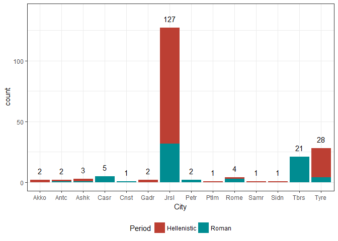

## Part 2

This graphs will look at the coins found in the archaeological site of Magdala, and form part of my thesis-writing process. The data had already been cleaned to only include the two factors I was interested in, city where the coin was minted and period from which the coin comes, Hellenistic (330 BCE to 6 CE) or Roman (6 AD to V century AD).   


```
## Parsed with column specification:
## cols(
##   N = col_integer(),
##   City = col_character(),
##   Period = col_character()
## )
```

<!-- -->

## Story

Magdala, one of the cities I am centring my analysis on, was one of the most important fishing sites on the coasts of the Sea of Galilee. In order to understand its relationship to other cities in the area, coins provide a useful variable. However, the Great Jewish Revolt of the First Century CE meant that Magdala suffered and was mostly abandoned.This can be seen on the fewer coins that come from the Roman period, as opposed to the previous Hellenistic one. Roman influence can also be seen on the larger amount of coins that come Rome. The cities of Caesarea (Casr), Tiberias (Tbrs), and Constantinople (Cnst) are a special case, since the first was founded at the very end of the Hellenistic period, while the second and third ones in the Roman period itself. Therefore, absence of coins from them is only natural. On the other hand, Petra (Petr), which is not too far from the area, did not appear before this period. Jerusalem (Jrsl) is clearly the dominant city in each period, although less so for the Roman one. The Phoenician city of Tyre, in which a major mint was located, also shows its importance during the Hellenistic period.

## The visualisation itself

The constraint to stick to a single image proved the hardest part. I was not able to show the overall percentage of coins from each period, or the total for each city as a single undivided block, which are both factors to which I want to bring attention to. I decided the present image was the most effective way to show the provenance of coins in Magdala through its different periods. The colours automatically chosen by RStudio were effective, but I changed their luminosity to make them a bit more contrasting. Instead of a graph for total numbers of coins, I settled for labeling the totals, although this had as an after effect that I had to expand the y axis to be able to show the number in Jerusalem. I was also unable to alter the order in which the periods were stacked, since I would have preferred Hellenistic to be on the bottom. 

I got the original data from the thesis of one the excavators at the site. Therefore, it should be truthful, or at least trustworthy. As for enlightening, it has no real present time stakes, but it is useful to me.
